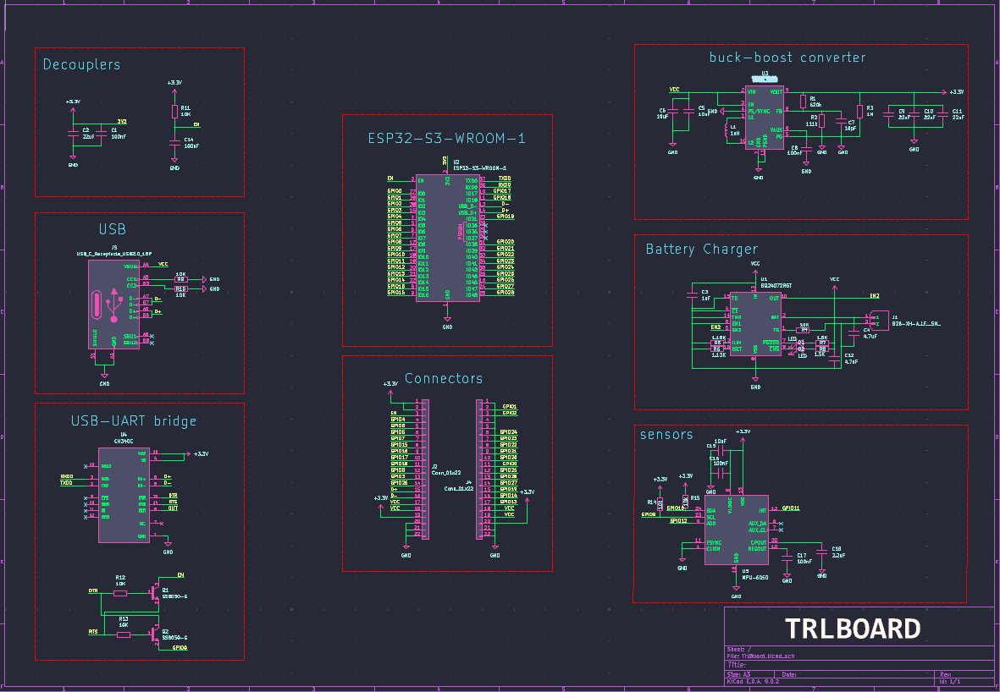
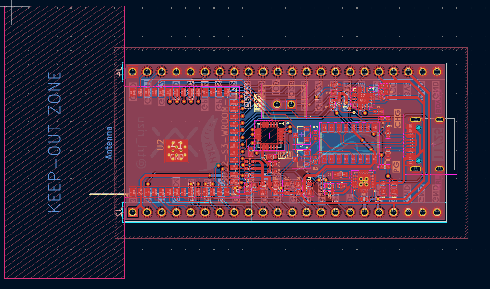
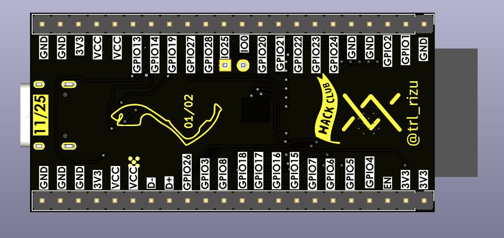
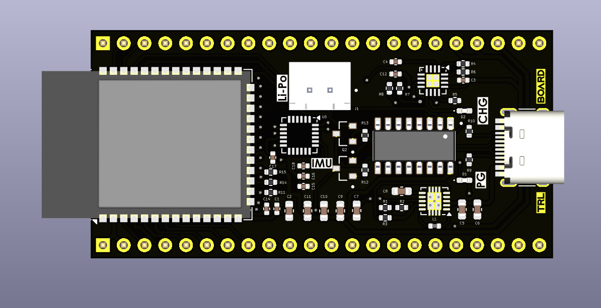
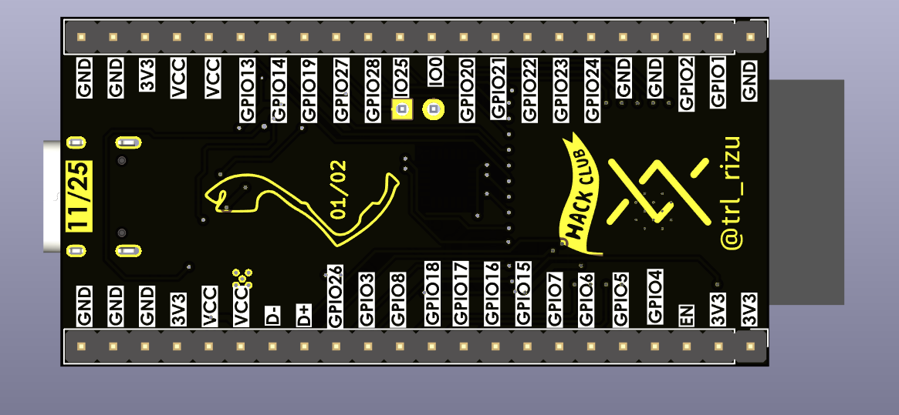
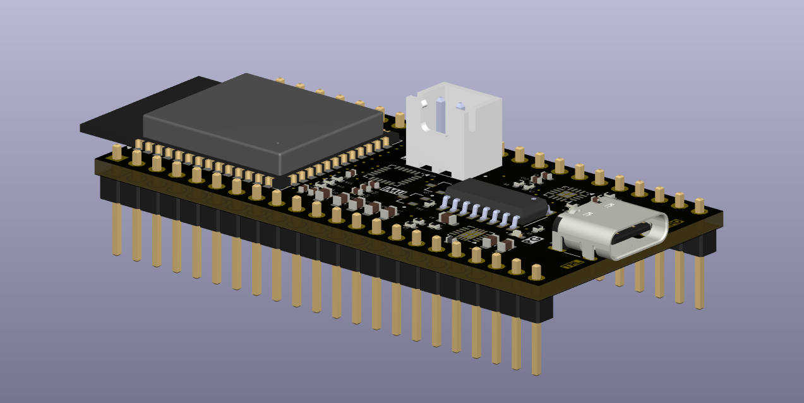

<h1 align="center">TRL BOARD</h1>
<h3 align="center">ESP32-S3-WROOM-1 Devboard • IMU + Battery Support</h3>

--- 

## Features
 - ESP-32-S3-WROOM-1
 - MPU-6050 IMU sensor
 - BQ24072RGT Battery Charger 
 - B2B-XH-A_LF__SN_ Connector
 - TPS63060 Buck Boost Converter
 - CH340C USB-UART bridge
 - USB-C connection
 - 1x20 x2 Connector pins (GPIO/GND/5V/3V3)

---

## PCB Schematic & Layout
#### See full [TrlBoard-schematic](TrlBoard-schematic.pdf).

The schematic: 

Front: 

Back: 

---

## Renders

---

## Bill Of Materials

The board is manufactured through JLCPCB's PCBA though not complete as the ESP32-S3-WROOM-1 and header pins are going to be hand-soldered.

> For the cost of the board's individual components check [Components](TrlBoard-Components.csv).

> For my case (PCBA + ESP32 + Connector pins) check [BOM](bom.csv)

# 🧾 Bill of Materials

| **Designator** | **Footprint**                   | **Quantity** | **Qty/Board** | **Value**           | **Link** | **Cost (USD)** | **Running Cost (USD)** |
|----------------|----------------------------------|---------------|----------------|----------------------|-----------|-----------------|------------------------|
| **PCBA**       | –                                | 2             | –              | –                    | [JLCPCB](https://jlcpcb.com) | **72.19** | **72.19** |
| **U2**         | ESP32-S3-WROOM-1                 | 2             | 1              | ESP32-S3-WROOM-1     | [AliExpress](https://www.aliexpress.com/item/1005008405001510.html?spm=a2g0o.cart.0.0.186438daN5XPTv&mp=1) | 11.58 | 83.77 |
| **J2, J4**     | PinHeader_1x22_P2.54mm_Vertical  | 4             | 2              | Conn_01x12           | [AliExpress](https://www.aliexpress.com/item/4000988113226.html?spm=a2g0o.cart.shoppingCartRecommend.1.186438daYJU8y5&gps-id=shoppingCartRecommend&scm=1007.13440.426876.0&scm_id=1007.13440.426876.0&scm-url=1007.13440.426876.0&pvid=39fa2927-4aee-480c-89c2-457762f75e3d&_t=gps-id:shoppingCartRecommend,scm-url:1007.13440.426876.0,pvid:39fa2927-4aee-480c-89c2-457762f75e3d,tpp_buckets:668%232846%238116%232002&pdp_ext_f=%7B%22order%22%3A%221947%22%2C%22eval%22%3A%221%22%2C%22sceneId%22%3A%223440%22%2C%22fromPage%22%3A%22recommend%22%7D&utparam-url=scene%3AshoppingCartRecommend%7Cquery_from%3A%7Cx_object_id%3A4000988113226%7C_p_origin_prod%3A) | 0.84 | 84.61 |
| **AliExpress Tax + Shipping Fee** | – | – | – | – | – | 2.23 | **86.84** |
| | | | | | | **Total Cost** | **86.84** |

Note: I didn't find any 1x22 pin connectors so why not just purchase 1x30pin and then cut off the excess?

---

## Intended purpose

TRL-Board is a flexible devboard aimed to power personal robotic prototypes, with ideas such as: 
- Quadrupped Bot
- Line-follower 
- Robotic Arm Mirrored control

Ideas to follow!

--- 

